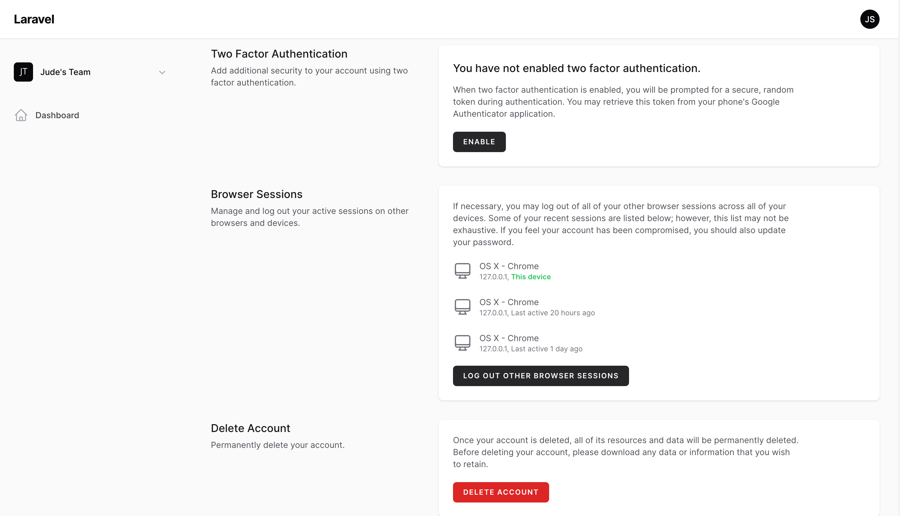
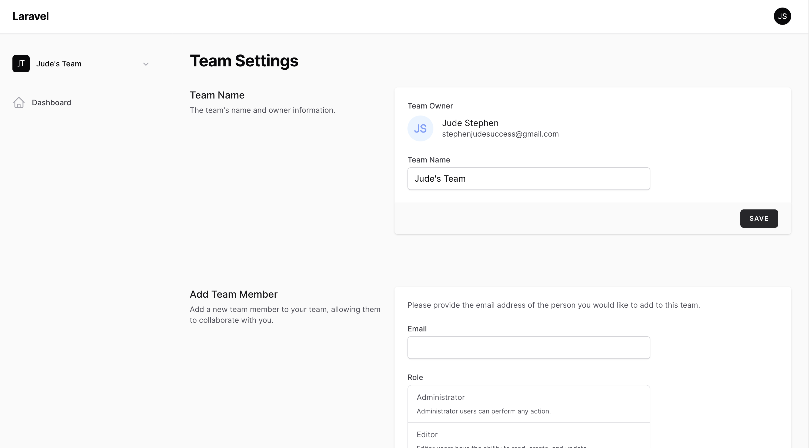
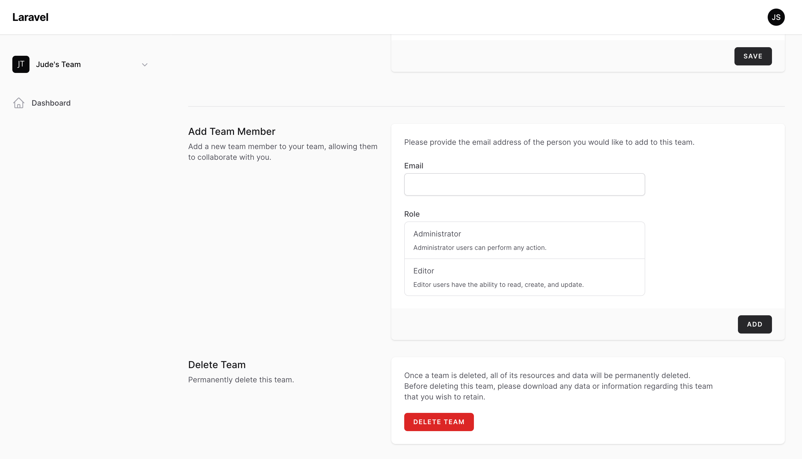
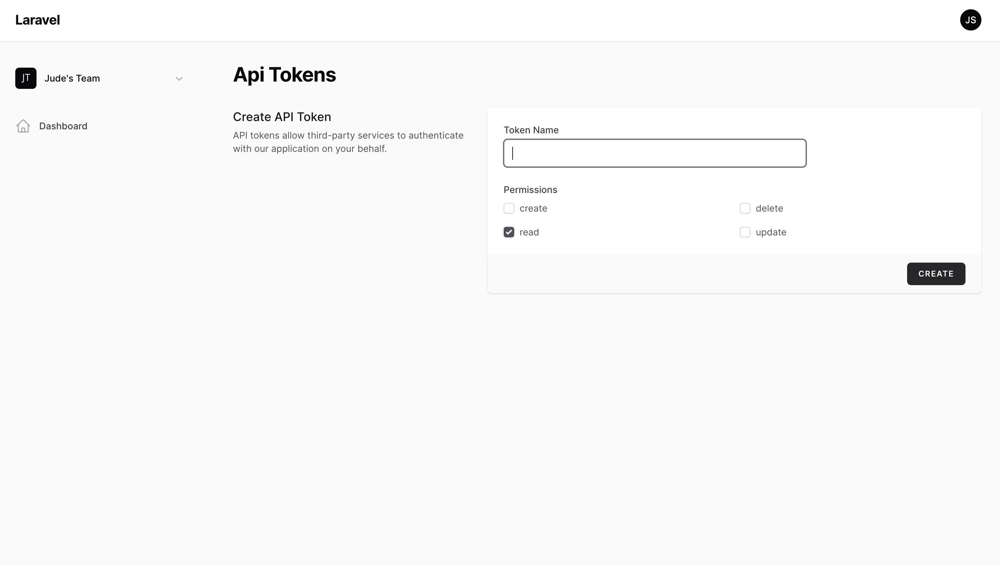

# Filament Jetstream

[](https://packagist.org/packages/stephenjude/filament-jetstream)
[](https://github.com/stephenjude/filament-jetstream/actions?query=workflow%3Arun-tests+branch%3Amain)
[](https://github.com/stephenjude/filament-jetstream/actions?query=workflow%3A"Fix+PHP+code+style+issues"+branch%3Amain)
[](https://packagist.org/packages/stephenjude/filament-jetstream)

This package seamlessly integrates all Laravel Jetstream features into your Filament application. Similar to Laravel Jetstream, it's designed for installation exclusively on a fresh Laravel application. There's no need to install Livewire, Jetstream, or Filament separately before using this package – it handles all the setup for you!

## How It Works

This package doesn't reinvent the wheel; instead, it leverages the Livewire components from Laravel Jetstream under the
hood, stripping away any unnecessary elements. You have the flexibility to enable or disable features through the
Jetstream configuration, and it seamlessly integrates with Filament for your panel.

## Installation

You can install the package via composer:

```bash
composer require stephenjude/filament-jetstream
```

## Install Jetstream With Teams And API Features

```shell
php artisan filament:jetstream:install --teams --api
```

You can remove the `--teams` and `--api` arguments if you don't want those features.

## Screenshots


---



---



---



---



## Testing

```bash
composer test
```

## Changelog

Please see [CHANGELOG](CHANGELOG.md) for more information on what has changed recently.

## Contributing

Please see [CONTRIBUTING](.github/CONTRIBUTING.md) for details.

## Security Vulnerabilities

Please review [our security policy](../../security/policy) on how to report security vulnerabilities.

## Credits

- [stephenjude](https://github.com/stephenjude)
- [taylorotwell](https://github.com/taylorotwell)
- [All Contributors](../../contributors)

## License

The MIT License (MIT). Please see [License File](LICENSE.md) for more information.
